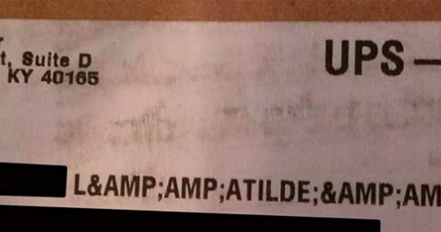

Fixing problems and getting explanations
========================================

Ode to a Shipping Label
-----------------------

A `poem about mojibake`_, whose original author might be `Carlos Bueno on Facebook`_, shows a shipping label that serves as an excellent example for this section, addressed to the surname `L&AMP;AMP;ATILDE;&AMP;AMP;SUP3;PEZ`.

.. _`poem about mojibake`: https://imgur.com/4J7Il0m
.. _`Carlos Bueno on Facebook`: https://www.facebook.com/cmb/posts/619241744770551:0

We can use ftfy not only to fix the text that was on the label, but to show us what happened to it (like the poem does)::

    >>> from ftfy import fix_and_explain, apply_plan
    >>> shipping_label = "L&AMP;AMP;ATILDE;&AMP;AMP;SUP3;PEZ"
    >>> fixed, explanation = fix_and_explain(shipping_label)
    >>> fixed
    'LóPEZ'

    >>> explanation
    [('apply', 'unescape_html'),
     ('apply', 'unescape_html'),
     ('apply', 'unescape_html'),
     ('encode', 'latin-1'),
     ('decode', 'utf-8')]

The capitalization is inconsistent because the encoding of a lowercase "ó" is in there, but everything was printed in capital letters.

The explanation may even be able to be applied to different text with the same problem::

    >>> label2 = "CARR&AMP;AMP;ATILDE;&AMP;AMP;COPY;"
    >>> apply_plan(label2, explanation)
    'CARRé'

Functions that fix text
-----------------------

The function that you'll probably use most often is :func:`ftfy.fix_text`, which applies all the fixes it can to every line of text, and returns the fixed text.

.. autofunction:: ftfy.fix_text

:func:`ftfy.fix_and_explain` takes the same arguments as :func:`ftfy.fix_text`, but provides an explanation, like we saw in the first section.

.. autofunction:: ftfy.fix_and_explain

Unlike :func:`ftfy.fix_text`, :func:`ftfy.fix_and_explain` doesn't separate the text into lines that it fixes separately -- because it's looking for a unified explanation of what happened to the text, not a different one for each line.

A more targeted function is :func:`ftfy.fix_encoding_and_explain`, which only fixes problems that can be solved by encoding and decoding the text, not other problems such as HTML entities:

.. autofunction:: ftfy.fix_encoding_and_explain

This function has a counterpart that returns just the fixed string, without the explanation. It still fixes the string as a whole, not line by line.

.. autofunction:: ftfy.fix_encoding

The return type of the `..._and_explain` functions is a kind of NamedTuple called `ExplainedText`:

.. autoclass:: ftfy.ExplainedText

These explanations can be re-applied to text using :func:`apply_plan`:

.. autofunction:: ftfy.apply_plan

Showing the characters in a string
----------------------------------

A different kind of explanation you might need is simply a breakdown of what Unicode characters a string contains. For this, ftfy provides a utility function, :func:`ftfy.explain_unicode()`.

.. autofunction:: ftfy.explain_unicode

A command-line utility that provides similar information, and even more detail, is lunasorcery's `utf8info`_.

.. _`utf8info`: https://github.com/lunasorcery/utf8info